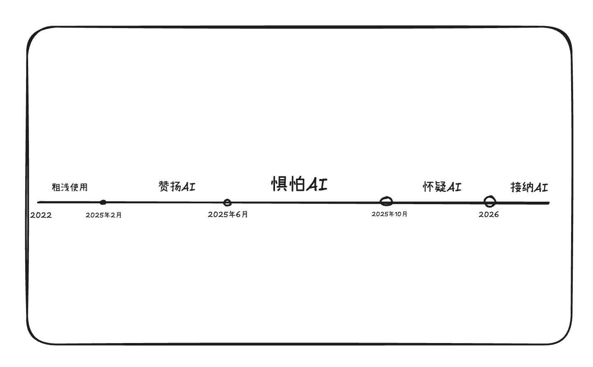
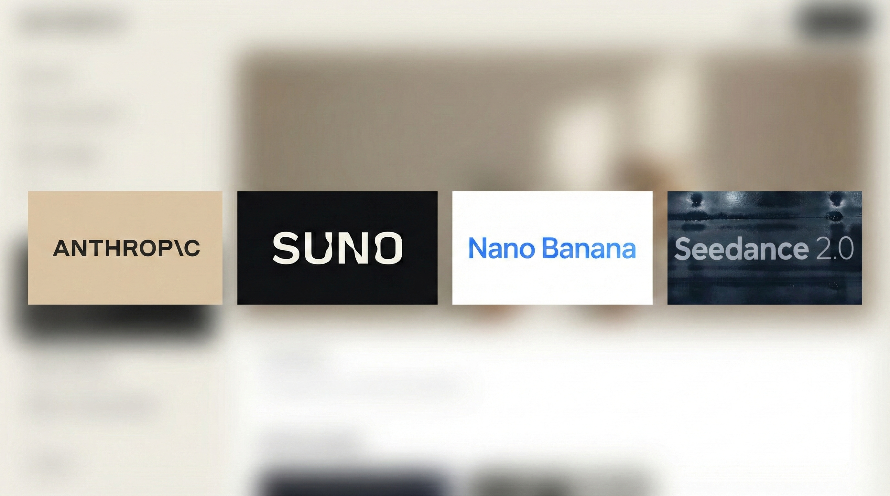
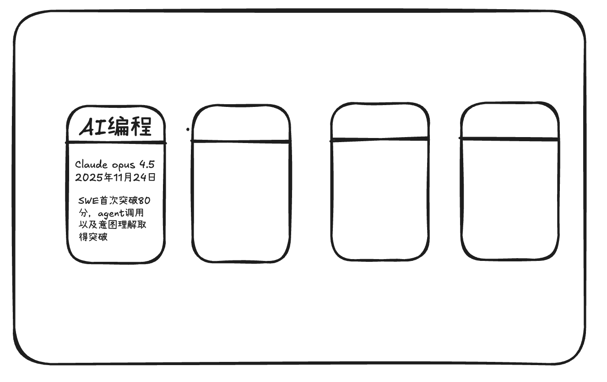
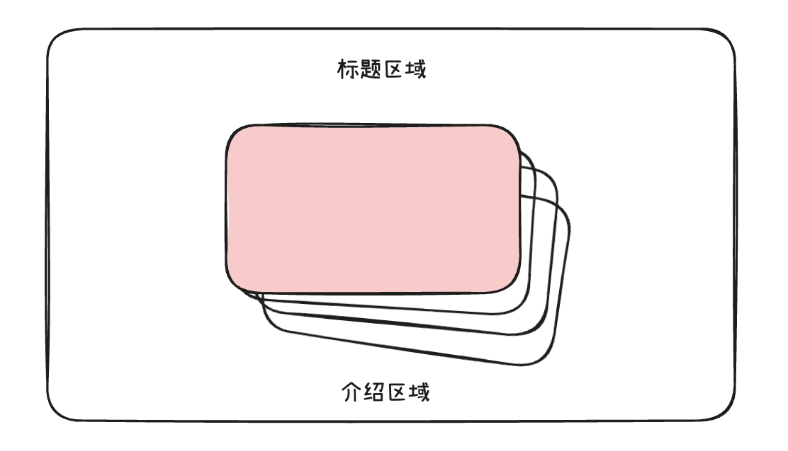
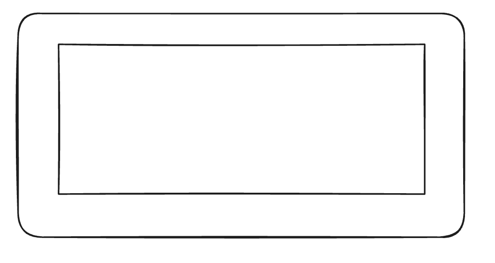
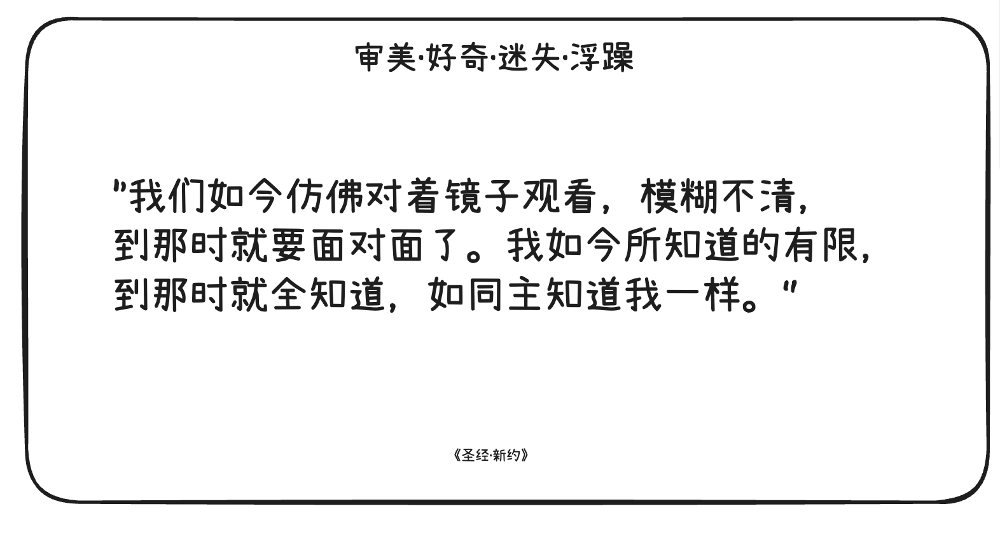

# I SEE YOU 原稿对齐文档（以 Obsidian 草稿为准）

## 1. 文档目的

本文件用于把原始草稿 `/Users/utolaris/Documents/obsidian/I see you.md` 的设计逻辑完整落到当前仓库，作为后续开发与验收的唯一基线。

重点目标：

- 每一页像 PPT 一样独立显示（上下翻页）
- 左右键仅切换当前页内部内容
- 页面间逻辑完全解耦
- 参考图进入仓库并可直接在文档中查看

---

## 2. 原稿与参考图（已迁移）

原稿引用图已从 Obsidian 复制到仓库目录：`doc-assets/i-see-you/`

- 第2页时间轴：`doc-assets/i-see-you/page-2-timeline.png`
- 第3页布局参考：`doc-assets/i-see-you/page-3-cards-layout.png`
- 第3页内容参考：`doc-assets/i-see-you/page-3-cards-content.png`
- 第4页图片堆叠：`doc-assets/i-see-you/page-4-gallery-stack.png`
- 第5页视频页：`doc-assets/i-see-you/page-5-video.png`
- 第7页艺术文本页：`doc-assets/i-see-you/page-7-art-text.png`

---

## 3. 页序基线（原稿 vs 当前工程）

原稿定义为 7 页：

1. 标题页
2. 时间轴
3. 卡片页
4. 图片堆叠页
5. 视频页
6. 表格页
7. 艺术文本页

当前工程存在一个额外占位页（Page 4 Reserved），导致页码偏移：

- 原稿第4页 == 工程 Page 5
- 原稿第5页 == 工程 Page 6
- 原稿第6页 == 工程 Page 7
- 原稿第7页 == 工程 Page 8

后续修复与验收必须始终以“原稿页序逻辑”对齐，而不是以当前偏移页号理解。

---

## 4. 全局交互与视觉基线（来自原稿）

- 上下键：翻页
- 左右键：切换当前页内部内容
- 右下角常驻页码
- 极简风格 + 流动高斯模糊背景（类似 Apple Music）
- 文本可调（大小、颜色）
- 响应式适配屏幕尺寸
- 每页独立模块，便于后续替换素材

---

## 5. 页面级设计规范（严格按原稿）

### 5.1 第1页：标题页

- 文案：`认识AI。`
- 大字居中
- 不显示其他元素

---

### 5.2 第2页：时间轴页

参考图：

设计要求：

- 页面只包含一条横向时间轴
- 关键点是实心圆节点
- 节点下方时间字体较小
- 节点上方阶段词更大（如“赞扬AI / 惧怕AI / 怀疑AI / 接纳AI”）
- 入场动画顺序必须是：

1. 时间轴线从左到右出现
2. 节点下方文字逐个出现
3. 节点上方阶段文字逐个出现

---

### 5.3 第3页：商用领域卡片页

参考图：

设计要求：

- 标题在顶部居中：`AI达到初步商用阶段的领域`
- 四个卡片以“发牌”方式从底部依次摊开
- 默认显示背面；点击后翻转显示正面内容
- 卡片为圆角，尺寸跟随文字内容可读性

卡片正面文案：

1. `AI编程` / `Claude opus 4.5` / `2025年11月24日` / `SWE首次突破80分，agent调用以及意图理解取得突破。`
2. `AI音乐` / `Suno v5` / `2025年9月23日` / `支持乐器音色克隆，人声分离，AI音乐首次登上热搜。`
3. `AI绘图` / `Nano banana pro` / `2025年11月20日` / `具备真实世界理解能力的全能绘图模型，面向广告设计。支持4K以多种比例。`
4. `AI视频` / `Seedance 2` / `2026年2月12日` / `视频，音频，图像三位一体理解能力。首个具备智能分镜的视频模型。`

---

### 5.4 第4页：图片堆叠页

参考图：

设计要求：

- 图片来自本地路径
- 左右键/鼠标触发下一张
- 默认显示堆叠态：当前图 + 后续 3 张
- 非当前图必须有高斯模糊遮罩
- 切换时：当前图快速向左淡出，下一图移动到中位
- 标题与介绍随图片同步切换
- 文本淡入淡出节奏需与图片切换一致
- 文本区在不同长度下始终居中稳定
- 当前图激活时，页面底部背景应能加载该图，改变整体观感

---

### 5.5 第5页：视频展示页

参考图：

设计要求：

- 视频 16:9，居中，大面积展示
- 视频来自本地
- 右键或右方向键切换下一视频
- 边框有轻度彩虹荧光（红橙黄绿蓝靛紫）

---

### 5.6 第6页：模型对比表格页

- 标题：`2026年2月主流AI编程模型。`
- 居中圆角表格
- 表格内容：

| 模型                     | 特质                                 |
| ------------------------ | ------------------------------------ |
| GPT-5.3-Codex High       | 保守、周密思维、安全、服从、高智商   |
| Claude Opus 4.6 Adaptive | 中立、自主创造力、自适应推理         |
| Kimi K2.5 Thinking       | 激进、过度自信、逻辑链不稳定         |
| Gemini 3 Pro Preview     | 艺术化、发散性思维、低遵从性、高情商 |

---

### 5.7 第7页：艺术文本页

参考图：

设计要求：

- 纯黑高斯模糊背景
- 顶部小标题：`审美·好奇·迷失·浮躁`
- 中央主体为原文（白色）
- 鼠标靠近触发探照灯：原文局部消失，底层中文译文（红色）显现
- 支持多段文本，左右键切换
- 底部小字来源随文本同步
- 不同文本长度下始终保持主体与底部来源居中

---

## 6. 当前实现偏差检查（2026-02-18）

### 6.1 结论概览

- 第2页：不符合（核心布局与原稿不一致）
- 第4页：部分符合（堆叠已做，但切换动线与背景联动未完整）
- 第7页：部分符合（探照灯逻辑有，但标题与背景风格未完全对齐原稿）
- 其他页：基本符合

### 6.2 逐页偏差

1. 第2页（时间轴）

- 当前实现不是“单条主轴+阶段词”视觉结构，和原图偏差明显。
- 判定：需要按原图重做结构与动效编排。

2. 第4页（图片堆叠）

- 现已实现 `active + next3` 与堆叠模糊。
- 但“当前图向左快速淡出、下一张进中位”的明确动线还不够强。
- “当前图驱动全页底部背景图变化”尚未完整落地。

3. 第7页（艺术文本）

- 探照灯双层文字已具备基础机制。
- 但顶部标题需固定为 `审美·好奇·迷失·浮躁`，背景应更接近“纯黑高斯模糊”语义。

---

## 7. 后续开发优先级（按风险）

1. 先重做第2页时间轴（结构正确优先于特效细节）。
2. 再补第4页切换动线与背景联动。
3. 最后校正第7页标题与背景语义一致性。

---

## 8. 验收标准（本轮）

- 文档与原稿页序逻辑一致（7页）
- 每页均可在本文件找到明确设计要求与参考图
- 参考图已进入仓库且路径可用
- 第2页被明确标记为当前不符合并给出修复方向
